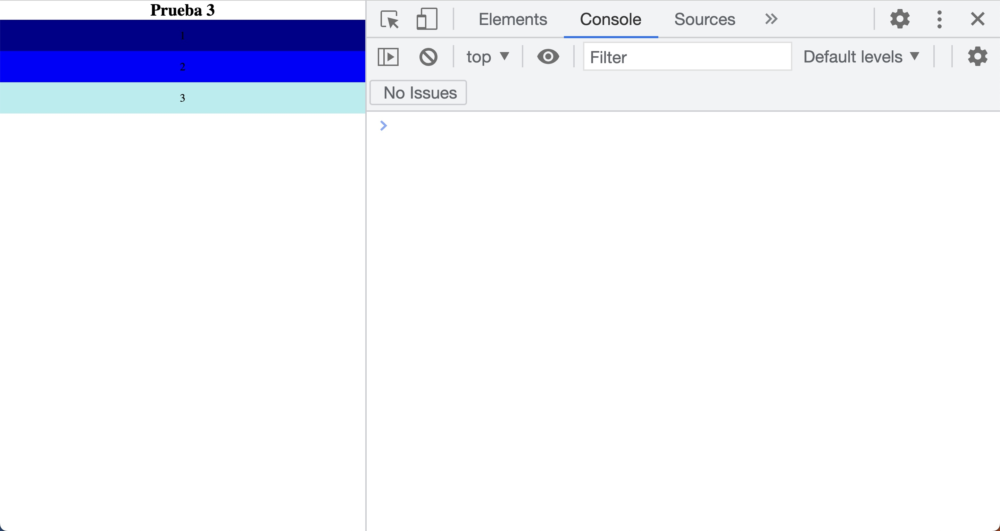
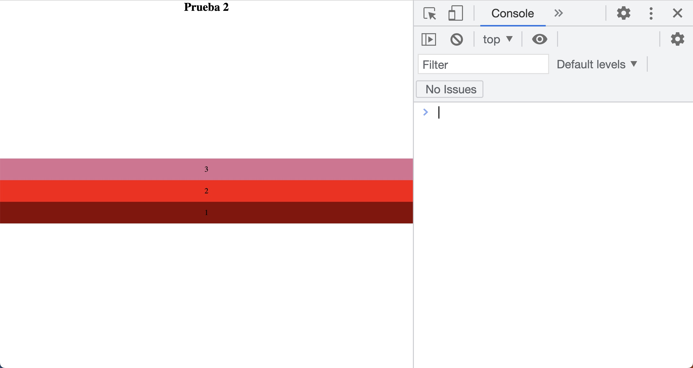
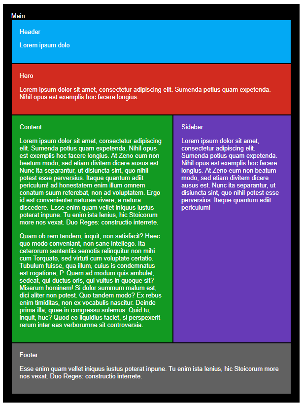

## Práctica de media query

1.- 

Tienes que conseguir reproducir las imagenes con este [html](./media.html)

1. Tamaño máximo de 600px

2. Entre 600px y 900px

3. Tamaño mínimo de 900px

2.- 

En este ejercicio haremos una página completamente "responsive" con la estrategia de "mobile first", que no es otra cosa que realizar el diseño para móvil inicialmente, e ir extendiendo la programación hacia resoluciones o tamaños de pantalla mayores.

### Vista mobile

### Vista tablet

### Vista desktop

## 📔 [Teoría](../README.md)
