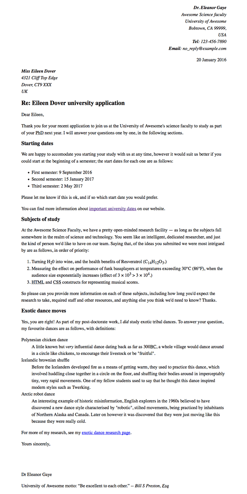

# Práctica HTML: Formateo de una carta

## Enunciado

En este ejercicio, realizaremos el marcado de una carta con las etiquetas de HTML que hemos aprendido.

El resultado sería el siguiente:

Contarás con la ayuda del texto en el siguiente archivo [Texto de carta](../../../assets/letter.txt)

+ ## 📔 [Teoría](../README.md)
